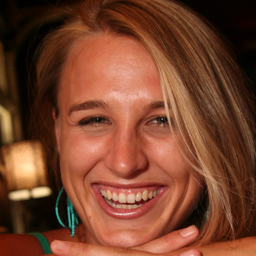
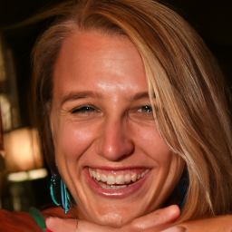

# Code Appendix of Idempotence and Perceptual Image Compression

# Prerequisites
* Environments:
    * python 3.10, pytorch 2.0.1, compressAI 1.1.5
    * other versions might work as well, but this is the version we have tested on.
* Pre-trained models:
    * all the Pre-trained model should be downloaded and put in ./bins
    * Pre-trained MSE codec:
        * ELIC pre-trained model by https://github.com/VincentChandelier/ELiC-ReImplemetation:
            * rate 1 (0.008): https://drive.google.com/file/d/1VNE7rx-rBFLnNFkz56Zc-cPr6xrBBJdL/view?usp=sharing
            * rate 2 (0.016): https://drive.google.com/file/d/1MWlYAmpHbWlGtG7MBBTPEew800grY5yC/view?usp=sharing
            * rate 3 (0.032): https://drive.google.com/file/d/1Moody9IR8CuAGwLCZ_ZMTfZXT0ehQhqc/view?usp=sharing
            * rate 4 (0.15): https://drive.google.com/file/d/1s544Uxv0gBY3WvKBcGNb3Fb22zfmd9PL/view?usp=sharing
            * rate 5 (0.45): https://drive.google.com/file/d/1uuKQJiozcBfgGMJ8CfM6lrXOZWv6RUDN/view?usp=sharing
        * Hyperprior pre-trained model by CompressAI:
            * rate 1：https://compressai.s3.amazonaws.com/models/v1/bmshj2018-hyperprior-1-7eb97409.pth.tar
            * rate 2: https://compressai.s3.amazonaws.com/models/v1/bmshj2018-hyperprior-2-93677231.pth.tar
            * rate 3: https://compressai.s3.amazonaws.com/models/v1/bmshj2018-hyperprior-3-6d87be32.pth.tar
            * rate 4: https://compressai.s3.amazonaws.com/models/v1/bmshj2018-hyperprior-4-de1b779c.pth.tar
            * rate 5: https://compressai.s3.amazonaws.com/models/v1/bmshj2018-hyperprior-5-f8b614e1.pth.tar
            * rate 6: https://compressai.s3.amazonaws.com/models/v1/bmshj2018-hyperprior-6-1ab9c41e.pth.tar
    * Pre-trained unconditional generative model by the authors of DPS:
        * DDPM on FFHQ, ImageNet: https://drive.google.com/drive/folders/1jElnRoFv7b31fG0v6pTSQkelbSX3xGZh

# Dataset Samples
* We provide the first 5 image of FFHQ, ImageNet, COCO and CLIC dataset in data/*_samples. Those images are un-curated. They are provide for demo purpose.
* To actually reproduce the number, the first 1000 samples of those datasets are needed. They can be obtained by:
    * FFHQ: https://www.kaggle.com/datasets/denislukovnikov/ffhq256-images-only
        * this is a convenient downscaled FFHQ dataset
    * ImageNet 2012: https://www.image-net.org/challenges/LSVRC/2012/
        * if you only need testing, download validation split is enough
    * COCO 2014: https://cocodataset.org/#download
        * download 2014 Val images is enouh
    * CLIC 2020: 
        * mobile: https://data.vision.ee.ethz.ch/cvl/clic/test/CLIC2020Mobile_test.zip
        * professional: https://data.vision.ee.ethz.ch/cvl/clic/test/CLIC2020Professional_test.zip
        * download the two splits and merge them into one

# Fast Run
* After downloading the pre-trained, the prepared dataset sample can be played with
    ```bash
    python -u run_codec.py --model_config=configs/ffhq_model_config.yaml --diffusion_config=configs/diffusion_config.yaml --task_config=configs/elic_config.yaml --save_dir=results
    ```
* The result is put in save_dir, with 4 sub-dir
    * label: the source image
    * mse_recon: the reconstruction of MSE codec
    * per_recon: the perceptual reconstruction of our proposed codec
    * re_recon: the recompressed perceptual reconstruction
* The correct behaviour is: 
    * mse_recon looks very blurry
    * per_recon looks sharp
    * re_recon looks very similar with mse_recon
* we provide an example of run results on 5 images of FFHQ, using elic bitrate 1, in results_example_ffhq_elic_q1
    * label: 
    * mse_recon: 
    * per_recon: 
    * re_recon: 
    * This example run should be able to be reproduced almost exactly by the above command

# Run Codec
* To run a codec with DDPM trained on FFHQ and ELIC base codec
```bash
python -u run_codec.py --model_config=configs/ffhq_model_config.yaml --diffusion_config=configs/diffusion_config.yaml \
--task_config=configs/elic_config.yaml --save_dir=results
```
* To run a codec with DDPM trained on Imagenet and ELIC base codec
```bash
python -u run_codec.py --model_config=configs/imagenet_model_config.yaml --diffusion_config=configs/diffusion_config.yaml \
--task_config=configs/elic_config.yaml --save_dir=results
```
* To run a codec with DDPM trained on FFHQ and Hyperprior base codec
```bash
python -u run_codec.py --model_config=configs/ffhq_model_config.yaml --diffusion_config=configs/diffusion_config.yaml \
--task_config=configs/hyper_config.yaml --save_dir=results
```
* To run a codec with DDPM trained on Imagenet and Hyperprior base codec
```bash
python -u run_codec.py --model_config=configs/imagenet_model_config.yaml --diffusion_config=configs/diffusion_config.yaml \
--task_config=configs/hyper_config.yaml --save_dir=results
```
* To run a codec with DDIM trained on Imagenet and ELIC base codec by DSG method
```bash
python -u run_codec.py --model_config=configs/imagenet_model_config.yaml --diffusion_config=configs/diffusion_ddim200_config.yaml \ --task_config=configs/elic_dsg_config.yaml --save_dir=results
```

* The dataset root and bitrate is in task_config.yaml.
* Evaluation:
    * to evaluate bpp, run the base codec test code:
    ```bash
    python test_elic.py
    python test_gg18.py
    ```
    * to evaluate mse, psnr and FID, run 
    ```
    python test_codec.py
    ```

# Notes
* All the links in this Readme.md are pointing to public, thirdparty sources, i.e., they do not contain any information about the identity of authors.
* This code base is heavily insipred by the the source code of DPS: https://github.com/DPS2022/diffusion-posterior-sampling 